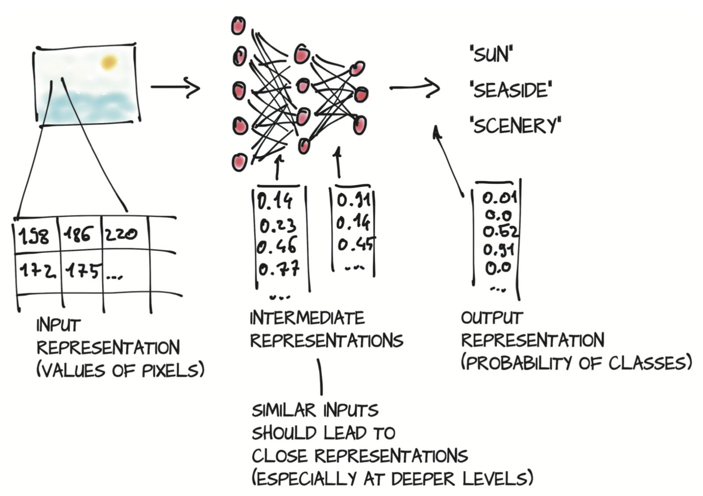
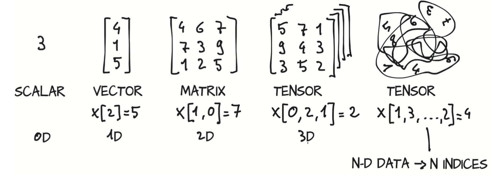

# It starts with a tensor
## Chapter covers
- Tensors, the basic data structure in PyTorch
- Indexing and operating on PyTorch tensors to explore and manipulate data
- Interoperating the Numpy multidimensional arrays
- Moving computation to the GPU for speed

### Converting the input into floating-point numbers
1. How: A deep neural network learns how to transform an input representation to an output representation.
    
2. Use Tensors
    